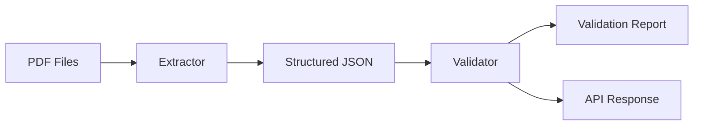

# Invoice Extraction & Quality Control Service

## 1. Overview
This project is an **Invoice Extraction & Quality Control Service** designed to automate the processing of B2B invoices. It includes:
- **Extraction Module**: Parses PDF invoices to extract structured data (JSON).
- **Validation Core**: Applies business and format rules to validate the extracted data.
- **CLI Tool**: A command-line interface for batch processing.
- **HTTP API**: A FastAPI-based service for real-time validation and extraction.
- **QC Console**: A simple web frontend to interact with the API.

## 2. Schema & Validation Design

### Schema Fields
The system extracts the following fields from each invoice:

**Invoice Level:**
- `invoice_number` (String): Unique identifier of the invoice.
- `invoice_date` (Date): Date of issue.
- `due_date` (Date): Payment due date.
- `seller_name` (String): Name of the vendor.
- `seller_address` (String): Address of the vendor.
- `seller_tax_id` (String): Tax ID / VAT number of the vendor.
- `buyer_name` (String): Name of the customer.
- `buyer_address` (String): Address of the customer.
- `buyer_tax_id` (String): Tax ID / VAT number of the customer.
- `currency` (Enum): Currency code (USD, EUR, GBP, INR).
- `net_total` (Float): Total amount before tax.
- `tax_amount` (Float): Total tax amount.
- `gross_total` (Float): Total amount to be paid (Net + Tax).

**Line Items:**
- `description` (String): Item description.
- `quantity` (Float): Quantity of items.
- `unit_price` (Float): Price per unit.
- `line_total` (Float): Total price for the line.

### Validation Rules

**Completeness Rules:**
- `invoice_number`, `invoice_date`, `seller_name`, `buyer_name`, and `gross_total` must be present.
- *Rationale*: These are the minimum fields required to identify a legal transaction.

**Format Rules:**
- `currency` must be one of the supported currencies (USD, EUR, GBP, INR).
- `net_total` and `gross_total` must be non-negative.
- *Rationale*: Ensures data consistency and prevents negative payments.

**Business Rules:**
- `net_total + tax_amount` must equal `gross_total` (within 0.05 tolerance).
- `due_date` must be on or after `invoice_date`.
- *Rationale*: Verifies mathematical correctness and logical date sequencing.

**Anomaly Rules:**
- Warning if `invoice_date` is > 2 years in the past or > 30 days in the future.
- *Rationale*: Flags potential data entry errors or outdated invoices.

## 3. Architecture

### Folder Structure
```
invoice-qc-service/
├── invoice_qc/
│   ├── __init__.py
│   ├── models.py       # Pydantic data models
│   ├── extractor.py    # PDF text extraction & parsing logic
│   ├── validator.py    # Rule-based validation logic
│   ├── cli.py          # CLI entrypoint (Typer)
│   └── api.py          # FastAPI application
├── web/
│   └── index.html      # Simple Frontend
├── requirements.txt    # Python dependencies
└── README.md           # Documentation
```

### Data Flow


## 4. Setup & Installation

### Prerequisites
- Python 3.10+

### Installation
1. Clone the repository.
2. Create a virtual environment:
   ```bash
   python -m venv venv
   source venv/bin/activate  # On Windows: venv\Scripts\activate
   ```
3. Install dependencies:
   ```bash
   pip install -r requirements.txt
   ```

## 5. Usage

### CLI
The CLI provides commands for extraction and validation.

**Extract Only:**
```bash
python -m invoice_qc.cli extract --pdf-dir ./pdfs --output extracted.json
```

**Validate Only:**
```bash
python -m invoice_qc.cli validate --input-json extracted.json --report report.json
```

**Full Run:**
```bash
python -m invoice_qc.cli full-run --pdf-dir ./pdfs --report report.json
```

### HTTP API
Start the server:
```bash
uvicorn invoice_qc.api:app --reload
```
> [!TIP]
> If port 8000 is occupied (e.g., by Splunk), run on a different port:
> ```bash
> uvicorn invoice_qc.api:app --reload --port 8081
> ```

**Endpoints:**
- `GET /health`: Check service status.
- `POST /validate-json`: Validate a list of invoice JSON objects.
- `POST /extract-and-validate-pdfs`: Upload PDFs for extraction and validation.

**Example (cURL):**
```bash
curl -X POST "http://localhost:8000/validate-json" \
     -H "Content-Type: application/json" \
     -d '[{"invoice_number": "INV-001", "invoice_date": "2024-01-01", "gross_total": 100}]'
```

### Frontend
1. Start the API server as above.
2. Open `web/index.html` in your browser.
3. Upload PDF files to see extraction and validation results.

## 6. AI Usage Notes
- **Tools Used**: Google Gemini.
- **Usage**:
  - Scaffolding the project structure.
  - Generating regex patterns for PDF extraction.
  - Writing Pydantic models and FastAPI endpoints.
  - Creating the HTML/JS frontend.
- **Correction**: Initially, the regex for date parsing was too simple. I added a `parse_date` function to handle multiple formats.

## 7. Assumptions & Limitations
- **PDF Layout**: Assumes a relatively standard invoice layout. Complex or scanned (image-only) PDFs will fail as no OCR is implemented (only text extraction).
- **Line Items**: Line item extraction is not implemented in the regex-based extractor due to the complexity of table parsing without visual layout analysis.
- **Currency**: Only detects symbols/codes for USD, EUR, GBP, INR.

## 8. Video
[Placeholder for Demo Video]

## 9. Integration
This service is designed as a microservice.
- **Upstream**: Can be triggered by a document arrival event (e.g., S3 bucket notification).
- **Downstream**: Validated data can be pushed to an ERP system or a queue (RabbitMQ/Kafka).
- **Containerization**: A `Dockerfile` can be added to package the app for Kubernetes/ECS.
